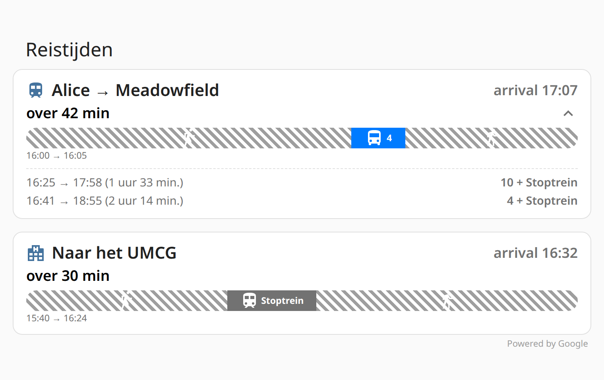

# Google Transit Routes

[](https://github.com/hacs/integration)
[](https://github.com/msberends/ha-google-transit-routes/releases)
[](LICENSE)

A Home Assistant custom integration that exposes the **full** Google Routes API
response for transit queries — most importantly the **scheduled arrival and
departure times** that the built-in `google_travel_time` integration silently
discards. Includes a wall-mounted-dashboard-friendly Lovelace card.

## Why this exists

The built-in `google_travel_time` integration only returns a duration and a
distance for a transit query. Internally it calls the same Google Routes API
this integration uses, but it throws away almost everything: stop names,
scheduled arrival/departure timestamps, transit line names, headsigns, vehicle
types, and stop counts never make it into Home Assistant.

| | `google_travel_time` (official) | `google_transit_routes` (this integration) |
|---|---|---|
| Duration / distance | ✅ | ✅ |
| Scheduled arrival & departure timestamps | ❌ | ✅ |
| Stop names (departure / arrival) | ❌ | ✅ |
| Transit line name, short name, color | ❌ | ✅ |
| Headsign / direction | ❌ | ✅ |
| Vehicle type (bus, train, tram, subway…) | ❌ | ✅ |
| Operating agency | ❌ | ✅ |
| Stop count per leg | ❌ | ✅ |
| Multiple alternative routes | ❌ | ✅ (up to 4, sorted by departure) |
| `duration_from_now` (accounts for wait time) | ❌ | ✅ |
| Sensor entities for saved routes | ✅ | ✅ |
| Wall-mounted dashboard card | ❌ | ✅ |
| Automatic polling | Yes (cost risk) | **No** — on-demand only, by design |

## Screenshot



*(rendered from the card's actual compiled code with representative sample
data — replace with a screenshot of your own dashboard once you have real
saved routes configured)*

## Features

- **`google_transit_routes.get_transit_route`** action: full transit
  itinerary with scheduled times, transit lines, stops, and up to 3
  alternative routes, returned as a clean `response_variable`.
- **`google_transit_routes.get_travel_time`** action: driving, walking,
  bicycling, and two-wheeler travel time and distance.
- **Sensor entities** for saved routes, with the next arrival time as state
  and the full itinerary (including alternatives) as attributes.
- **`duration_from_now`**: a single number that already accounts for how long
  you'll wait for the first departure — computed fresh every time the
  attribute is read, not just when the API was last called.
- **No automatic polling.** Sensors only call the API when you trigger
  `homeassistant.update_entity` — see [API quota](#api-quota) for why.
- **Lovelace dashboard card** (`google-transit-routes-card`) built for
  wall-mounted tablets: large text, live ticking countdowns, a coloured
  journey bar per route, and tap-to-expand alternatives.
- Entity resolution: use an address, `"lat,lng"` coordinates, or an HA
  entity (`zone.*`, `person.*`, `device_tracker.*`, `sensor.*`) as origin or
  destination.

## Installation

### Via HACS

1. HACS → Integrations → ⋮ → Custom repositories.
2. Add `https://github.com/msberends/ha-google-transit-routes` as an
   **Integration**.
3. Search for "Google Transit Routes" and install.
4. Restart Home Assistant.

### Manual

1. Copy `custom_components/google_transit_routes` into your Home Assistant
   `config/custom_components/` directory.
2. Restart Home Assistant.

## Configuration

Configuration happens entirely through the UI:

1. Settings → Devices & Services → Add Integration → **Google Transit
   Routes**.
2. Enter your [Google Routes API key](#api-key-setup). It's validated with a
   live test request before you can continue.
3. Optionally add one or more named routes (origin, destination, language).
   Each saved route becomes a sensor. You can skip this step and only use the
   actions for on-demand queries.
4. Afterwards, use the integration's **Configure** option to add/remove saved
   routes or change the API key at any time.

## Usage: Actions

Call `google_transit_routes.get_transit_route` from an automation or script
with a `response_variable`, then index into `routes[]` — route `0` is always
the earliest:

```yaml
actions:
  - action: google_transit_routes.get_transit_route
    data:
      origin: "zone.umcg_noord"
      destination: "zone.station_meadowfield"
      language: "nl"
    response_variable: transit

  - action: ntfy.publish
    data:
      title: "🚆 Alice vertrokken"
      message: >-
        Alice is vertrokken vanuit het UMCG.
        Verwachte aankomsttijd: {{ transit.routes[0].arrival_time_local }} uur
        (over {{ transit.routes[0].duration_from_now_text }}).
        Via: {{ leg.line_name }} ({{ leg.headsign }}), .
        
        Alternatief: {{ transit.routes[1].departure_time_local }} → {{ transit.routes[1].arrival_time_local }} uur.
        
    target:
      entity_id: notify.bob
```

For driving/walking/bicycling, use `google_transit_routes.get_travel_time`
with `mode: driving|walking|bicycling|two_wheeler`.

Manual testing: Developer Tools → Actions → call `get_transit_route` and
inspect the response there directly.

## Usage: Sensors

Each saved route is exposed as `sensor.google_transit_<slugified_name>`.
**It never polls automatically** — trigger it explicitly:

```yaml
actions:
  - action: homeassistant.update_entity
    target:
      entity_id: sensor.google_transit_umcg_to_meadowfield
```

A simple entities card:

```yaml
type: entities
entities:
  - entity: sensor.google_transit_umcg_to_meadowfield
    name: "Volgende trein naar Meadowfield"
```

Recommended pattern — refresh on a schedule during relevant hours, or when
someone leaves a zone, rather than polling constantly:

```yaml
automation:
  - alias: "Ververs reistijd UMCG - werkdagen ochtend"
    trigger:
      - trigger: time_pattern
        minutes: "/10"
    condition:
      - condition: time
        after: "06:30:00"
        before: "09:00:00"
      - condition: state
        entity_id: binary_sensor.workday_sensor
        state: "on"
    action:
      - action: homeassistant.update_entity
        target:
          entity_id: sensor.google_transit_umcg_to_meadowfield
```

## Usage: Dashboard card

```yaml
type: custom:google-transit-routes-card
title: "Reistijden"
entities:
  - entity: sensor.google_transit_umcg_to_meadowfield
    name: "Alice → Meadowfield"
    icon: mdi:train
  - entity: sensor.google_transit_meadowfield_to_umcg
    name: "Naar het UMCG"
    icon: mdi:hospital-building
show_alternatives: true
show_legs: true
show_countdown: true
refresh_interval: 0     # 0 = off (default). See the warning below before changing this.
theme: auto
compact: false
```

Use the visual editor (Edit Dashboard → Add Card → Google Transit Routes
Card) to configure routes, toggles, and the refresh interval without
touching YAML. Tap a route row to expand its alternative departures.

> [!WARNING]
> `refresh_interval` defaults to `0` (off) on purpose. If you set it to a
> non-zero value, the card itself calls `homeassistant.update_entity` on
> every route shown — on repeat, for as long as the card is on screen. A
> single sensor refreshed every 5 minutes on an always-on wall-mounted
> tablet is already ~8,600 API calls/month, almost double the free quota,
> **by itself**. This directly conflicts with the "no automatic polling"
> design of the sensors (see [API quota](#api-quota)) if left on
> unattended. Only enable it if you've deliberately budgeted for the
> quota, and prefer driving refreshes from an automation instead (see
> [Usage: Sensors](#usage-sensors)) so refresh timing is tied to something
> that actually matters (a time window, a zone change) rather than "the
> screen happens to be on".

## API key setup

1. Go to the [Google Cloud Console](https://console.cloud.google.com/).
2. Create (or select) a project, then enable the **Routes API** — no other
   API needs to be enabled.
3. Create an API key under APIs & Services → Credentials. Restrict it to the
   Routes API for safety.
4. Paste that key into the integration's config flow — it's validated with a
   live request before setup completes.

## API quota

Transit queries hit the **Compute Routes Pro** SKU, which has a free cap of
**5,000 requests/month** (since the March 2025 pricing change). Beyond that,
Google charges **$10 per 1,000 requests**.

That's why this integration **never polls automatically**:

- Sensors have `update_interval=None` — they only refresh when you call
  `homeassistant.update_entity`.
- Two sensors polling every 15 minutes would already exceed the free cap on
  their own.
- Build your own refresh cadence with automations (see
  [Usage: Sensors](#usage-sensors)) so you only spend calls when the data
  actually matters — e.g. on a time window, or when someone leaves a zone.
- The dashboard card's `refresh_interval` option defaults to `0` (off) for
  the same reason: it calls `homeassistant.update_entity` under the hood,
  so turning it on for an always-on wall-mounted display quietly
  reintroduces automatic polling. See the warning in
  [Usage: Dashboard card](#usage-dashboard-card).

## Response reference

`get_transit_route` always returns a `routes` list, sorted by departure time
(earliest first), with up to 4 entries (the primary route plus alternatives):

```yaml
routes:
  - arrival_time: "2026-07-31T23:24:00Z"        # UTC, last transit leg's arrival
    arrival_time_local: "01:24"                  # localised time string
    arrival_timezone: "Europe/Amsterdam"
    departure_time: "2026-07-31T22:26:00Z"       # UTC, first transit leg's departure
    departure_time_local: "00:26"
    departure_timezone: "Europe/Amsterdam"
    duration: 4091                                # total seconds, from the API
    duration_text: "1 uur 8 min."
    duration_from_now: 3480                       # seconds from now to arrival_time
    duration_from_now_text: "58 min."              # computed fresh on every read
    distance_meters: 42900
    distance_text: "42,9 km"
    legs:
      - mode: "WALK"
        duration: 480
      - mode: "BUS"
        line_name: "4"                            # nameShort, falls back to full name
        line_full_name: "Station Noord - HS - Korreweg - P+R Hoogkerk"
        headsign: "Hoofdstation"
        departure_stop: "Groningen, UMCG Noord"
        departure_time: "2026-07-31T22:26:00Z"
        departure_time_local: "00:26"
        arrival_stop: "Groningen, Hereplein"
        arrival_time: "2026-07-31T22:31:00Z"
        arrival_time_local: "00:31"
        stop_count: 5
        agency: "Qbuzz"
        line_color: "#007bff"
        vehicle_type: "BUS"
      - mode: "WALK"
        duration: 240
      - mode: "HEAVY_RAIL"
        line_name: "Stoptrein"
        line_full_name: "Groningen <-> Leeuwarden ST37400"
        headsign: "Leeuwarden"
        departure_stop: "Groningen"
        departure_time: "2026-07-31T22:54:00Z"
        departure_time_local: "00:54"
        arrival_stop: "Meadowfield"
        arrival_time: "2026-07-31T23:24:00Z"
        arrival_time_local: "01:24"
        stop_count: 11
        agency: "Arriva"
        vehicle_type: "HEAVY_RAIL"
    attribution: "Powered by Google"
  - arrival_time: "2026-08-01T00:27:00Z"          # second (later) route option
    # ... same structure as above ...
```

Notes:

- Top-level `arrival_time`/`departure_time` refer to the **transit** legs
  only (not any trailing/leading walk), since that's what matters when you
  ask "when does the train arrive".
- `legs` always includes `WALK` segments with their `duration`, so you can
  see the full picture from door to door. Consecutive walking directions
  from Google are merged into a single leg per transfer.
- `line_name` prefers `transitLine.nameShort` (e.g. `"4"`) over the full
  route description, because that's what's printed on the vehicle. Both are
  included.
- Sensor entities expose the primary route's fields directly as attributes,
  plus `alternative_routes` (the remaining `routes[1:]`), `route_count`, and
  `attribution`.

`get_travel_time` returns a simpler structure with no transit legs:

```yaml
routes:
  - duration: 3695
    duration_text: "1 uur 2 min."
    static_duration: 3695
    static_duration_text: "1 uur 2 min."
    distance_meters: 78005
    distance_text: "78,0 km"
    attribution: "Powered by Google"
```

## Attribution

Google requires attribution for use of the Routes API. This integration
includes "Powered by Google" in every sensor's attributes, in every action
response, and in the Lovelace card's footer.

## Contributing

Issues and pull requests are welcome at
[msberends/ha-google-transit-routes](https://github.com/msberends/ha-google-transit-routes).
Please include anonymised fixture data (see `tests/fixtures/`) when reporting
parsing issues.

## License

[MIT](LICENSE)
